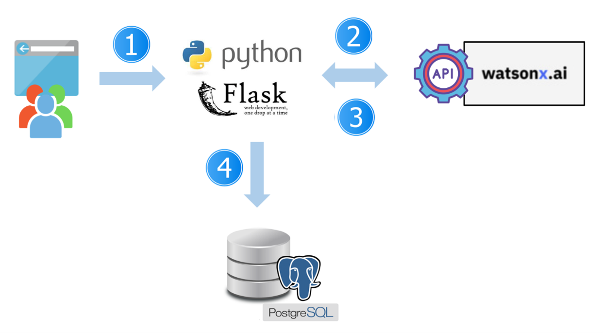
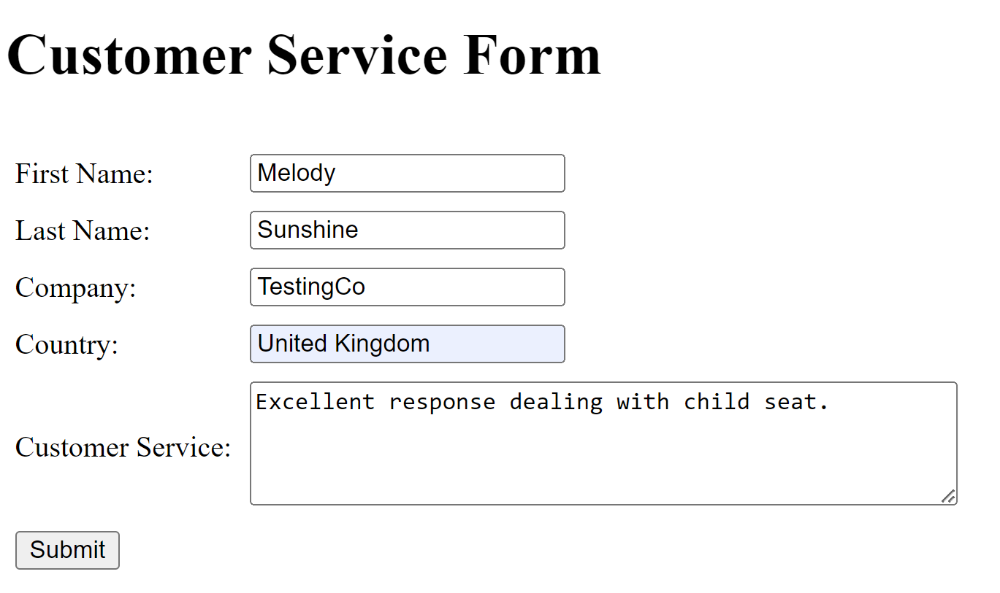
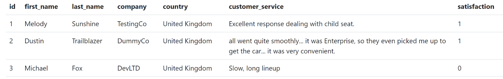
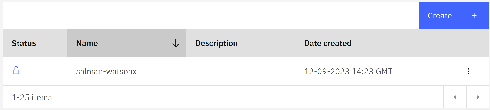
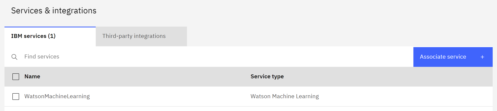

# Determine customer satisfaction with watsonx.ai

IBM Watsonx is the next-generation AI platform for building and tuning foundation models, generative AI and machine learning systems. IBM Watsonx applies pretrained AI models to a wide range of use cases, including sentiment analysis, identification of insights from documents and the generation of code or other content. This offering presents a huge potential for increasing productivity and time to value for IBM customers. 

Sentiment analysis is a powerful technique utilised for determining the emotional tone behind a text or comment. It has many applications, from understanding customer feedback to plan our next actions. IBM Watsonx.ai, which includes large language models (LLMs), can help organisations build customised applications to solve their business challenges, including sentiment analysis. This is a popular way for organisations to classify comments about a product or a service. Organisations can easily leverage the IBM LLM model in Watsonx.ai to determine the sentiment of customer service comments.


## Architectural Design

The architectural design used to implement an effective sentiment analysis is shown below.



* Step 1: The user opens a customer service form, fills out some details with their comment and submits the form.



* Step 2: The customer service application receives the user’ comment and passes it to the API exposed by Watsonx.ai to get the sentiment result. The sentiment result can be recognised as positive (1) or negative (0). The customer service application named `sentiments_detection.py` is developed in Python. It provides a Flask micro web service to receive the form filled out by users.


* Step 3: Watsonx.ai determines the sentiment and returns the result to the customer service application. The implementation of this step can be achieved using prompt engineering with variuos models such as `FLAN-UL2`.

* Step 4: The customer service application developed in Python receives the sentiment and records it with all the other information in a relational database such as a PostgreSQL table.




## IBM Cloud API Key

An IBM Cloud API Key is used as part of automation (e.g. program or script, etc.) to log in as a user identity. You can use the IBM Cloud console to manage your API keys by listing your keys, creating keys, updating keys, or deleting keys. You can log in the IBM Cloud, and complete the following steps.

* Step 1. In the IBM Cloud console, go to **Manage** > **Access (IAM)** > **API keys**.
* Step 2. Click **Create** an IBM Cloud API key.
* Step 3. Enter a name and description for your API key.
* Step 4. Click **Create**.
* Step 5. Then, click **Show** to display the API key. Or, click **Copy** to copy and save it for later, or click **Download**.




## IBM Watsonx Project

Login to the Watsonx console and create a project. You can create a sandbox project to collaborate with your team on working with data and other resources to achieve a particular goal, such as building a model. To create a project, complete the following steps.

* Step 1. Choose **Projects** > View all projects from the navigation menu and click **New project**.
* Step 2. Choose **Create an empty project**.
* Step 3. Add a name on the **New project** screen.
* Step 4. Choose an existing object storage service instance or create a new one.
* Step 5. Click **Create**.


## Adding a Watson Machine Learning service to the IBM Watsonx project

After you create a project, you must associate a `Watson Machine Learning` service instance with the project. To associate the `Watson Machine Learning` service to the project, complete the following steps.

* Step 1. Go to the project's **Manage** tab and select the **Services and integrations** page.
* Step 2. In the IBM Services section, click **Associate Service**.
* Step 3. Select the **Watson Machine Learning** service instance and click **Associate**.




## IBM Watsonx Project ID

To prompt foundation models in IBM watsonx.ai programmatically, you need to pass the identifier (ID) of a watsonx.ai project that has an instance of IBM Watson Machine Learning associated with it.
To find the ID of a project, navigate to the project in the watsonx.ai web console, click the Manage tab, then find the project ID in the General information area.


## Configuration File

Open the `var_config.py` file and set the value of variables, including `Watsonx Project ID`, `IBM Cloud API Key` and the access information for the `PostgreSQL` database such as database name, database username, database password, host name and port number. These variables in the configuration file should be set before you run the `sentiments_detection.py` file.

```
# Watsonx Project ID
PROJECT_ID='<PROJECT-ID>'

# IBM Cloud API Key
API_KEY='<API-KEY>'

# Access Info for the PostgreSQL Database
DB_NAME = '<DB-NAME>'
DB_USER = '<DB-USER>'
DB_PASSWORD = '<DB-PASSWORD>'
DB_HOST = '<DB-HOST>'
DB_PORT = '<DB-PORT>'
```


## Customer Service Form

The customer service form is the web page, where the end-user fills out some details with their comment and submits the form. Firstly, you need to create a folder named `templates` in the Python application directory. Afterwards, save the HTML page named `index.html` in the `templates` folder.
When you run the customer service application developed in Python by executing the following command, open your browser, and go to the `http://127.0.0.1:5000/` address.

```
python sentiments_detection.py
```


## Contact

I would like to hear from IBMers using IBM Watsonx. 
If you have any question, please send an email to Salman.Taherizadeh@ibm.com

